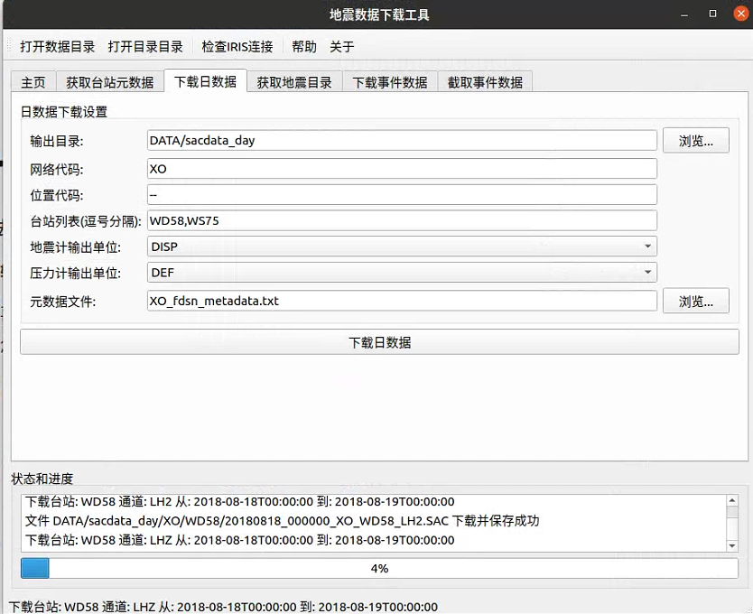

<div align=center></div>

# 地震数据下载工具 (DownloadSeisDataGUI)

这是一个基于PyQt5开发的地震数据下载工具图形界面，用于从IRIS数据中心下载和处理地震数据。

作者：吴悦初 (12131066@mail.sustech.edu.cn)

## 功能特点

该工具包含五个主要功能模块：

1. **获取台站元数据**：下载地震台站的元数据信息
2. **下载日数据**：下载指定台站的连续日数据
3. **获取地震目录**：获取指定区域和时间范围内的地震目录
4. **下载事件数据**：根据地震目录下载事件波形数据
5. **截取事件数据**：从已下载的日数据中截取事件数据

## 安装依赖

本程序依赖以下Python库：

```bash
pip install PyQt5 numpy pandas obspy tqdm
```

## 使用方法

1. 运行主程序：

```bash
python main.py
```

2. 界面会显示五个选项卡，对应五个主要功能。按照顺序执行这些功能：

   - 首先获取台站元数据
   - 然后获取地震目录
   - 接下来可以选择下载日数据或者直接下载事件数据
   - 如果已经下载了日数据，可以使用"截取事件数据"功能从日数据中提取事件数据

3. 每个选项卡中的参数都有默认值，可以根据需要进行修改。

## GUI界面使用说明

程序启动时会显示主界面，包含五个功能选项卡和一个主页选项卡。主页选项卡提供了基本的使用说明和帮助信息。

### 常见问题解决方案

1. **问题：程序启动时自动执行下载脚本**
   
   解决方案：最新版本已修复了这个问题。现在程序启动时不会自动执行任何下载操作，只有当用户点击界面上的相应按钮后才会开始下载。

2. **问题：下载过程中界面无响应**
   
   解决方案：所有下载和处理操作都在独立的工作线程中执行，界面应该保持响应。如果发现界面卡顿，可能是由于数据量过大导致。建议尝试下载少量数据进行测试。

3. **问题：无法连接到IRIS服务器**
   
   解决方案：可以使用工具栏中的"检查IRIS连接"按钮测试与IRIS服务器的连接。如果连接失败，请检查您的网络连接或尝试稍后再试。
   
4. **问题：如何同时下载多个台站的数据**
   
   解决方案：在相应的输入框中输入多个台站代码，用逗号分隔（例如：`WD58,WS75`）。
   
### 最佳实践

1. 开始使用前，建议先查看主页选项卡了解基本操作流程。
2. 每个选项卡底部状态区会显示当前操作的进度和状态信息。
3. 所有操作都会在执行前显示确认对话框，确认后才会开始执行。
4. 可以使用工具栏上的按钮快速访问数据目录和地震目录。

## 数据目录结构

程序会创建以下目录结构：

```
.
├── XO_fdsn_metadata.txt          # 台站元数据文件
├── catalog/                      # 地震目录目录
│   └── XO/                       # 网络代码
│       └── XO_WD58_catalog.txt   # 台站的地震目录
├── DATA/
│   ├── sacdata_day/              # 日数据目录
│   │   └── XO/                   # 网络代码
│   │       └── WD58/             # 台站代码
│   │           └── ...           # 日数据文件
│   └── sacdata_event/            # 事件数据目录
│       └── 20181005_123456/      # 事件ID（时间格式）
│           └── ...               # 事件数据文件
```

## 注意事项

1. 下载大量数据可能需要较长时间，请耐心等待。
2. 建议先下载少量台站的数据进行测试，确认一切正常后再下载更多数据。
3. 可能需要稳定的网络连接以确保数据下载完整。
4. 程序会自动跳过已经存在的文件，因此如果下载中断，可以直接重新运行相同参数的下载任务继续完成下载。

## 许可证

MIT License

# DownloadSeisData

`DownloadSeisData` is a software package that automatically downloads seismic data. We strongly recommend using the Python version based on [ObsPy](https://github.com/obspy/obspy). It can automatically download station metadata, daily waveform data, and instrument responses. In addition, it can also download earthquake catalogs and waveform data of earthquake events based on station metadata. All waveform data is saved in `SAC` format. Since the corresponding response file is downloaded, We can convert the units of the waveform to displacement, velocity, acceleration (seismometer), or pressure (pressure gauge). At the same time, `DownloadSeisData` also saves station information and event information in the SAC header for subsequent use.

Now you can conveniently download seismic data using the `DownloadSeisData` app.

Introduction to the usage of `DownloadSeisData` app on the [Bilibili](https://www.bilibili.com/video/BV1xETMegE5f/?share_source=copy_web&vd_source=6749f185103c3e99f2bb4b384f044916).


<div align=center></div>


## Python version manual
The Python version is based on [ObsPy](https://github.com/obspy/obspy), very concise and easy to read. It is strongly recommended to use this version, and the Bash version will no longer be maintained.


### Requirements
- python 3.8+
- `obspy` installation instructions can be found in the [wiki](https://github.com/obspy/obspy/wiki#installation).
- [numpy](https://github.com/numpy/numpy)
- [pandas](https://github.com/pandas-dev/pandas) to read and write table file.
- [tqdm](https://github.com/tqdm/tqdm) to get progressbars.


## Shell version manual
Automatic download of seismic data by using `FetchMetaData`, `FetchEvent` and `FetchData`.

(Optional) Data preprocessing by using `mseed2sac` and `SAC`.

### Chinese introduction
[被动源OBS数据处理（1）：下载地震数据](https://mp.weixin.qq.com/s/GmxilrDyoDM29OMEzBoSRw)

[被动源OBS数据处理（2）：地震数据预处理](https://mp.weixin.qq.com/s/kVvvKB2QE_1ZgR6mXHAkPQ)

### Preparation
Download the IRIS DMC's Fetch scripts from [http://service.iris.edu/clients](http://service.iris.edu/clients/). Rename and give executable permissions.

```shell
mv FetchMetadata-2014.316 FetchMetadata
mv FetchEvent-2014.340 FetchEvent
mv FetchData-2020.314 FetchData
chmod +x FetchMetadata FetchEvent FetchData
```

Add the following statement to `~/.zshrc` of Mac OS user (or `~/.bashrc` of Linux user) to configure environment variables.
```shell
export PATH=your/path/of/Fetch/scripts:$PATH
```
### Optional preparation
Install [mseed2sac](https://github.com/iris-edu/mseed2sac) and [SAC](https://ds.iris.edu/ds/nodes/dmc/forms/sac/) if using scripts `c1_mseed2sac_day` and `c2_mseed2sac_event`.

#### Install mseed2sac
```shell
tar -zxvf mseed2sac-2.3.tar.gz
cd mseed2sac-2.3/
make
sudo cp mseed2sac /usr/local/bin/
```

#### [Install SAC](https://seisman.github.io/SAC_Docs_zh/install/)

Install `SAC` if using scripts `d1_daydata_preprocess` and `d2_eventdata_preprocess`.


### Get metadata
Set network, station, location and channel in `a1_get_metadata` for seismic data download.

```shell
network=XO
stations=WD52,WD55
location=--,00
allchannel=HH?,BH?,HDH,BDH,EDH

```
Run `a1_get_metadata.bash`
```shell
bash a1_get_metadata.bash
```
Then a metadata text file will be generated, and users can change the fourth column (start) and fifth column (end) to download the data of the corresponding time interval.

```
XO WD52 HDH,HH1,HH2,HHZ 2018-07-18 2019-09-03 54.046622 -159.346215 -2563.6
XO WD55 HDH,HH1,HH2,HHZ 2018-07-20 2019-09-01 55.761625 -153.662817 -1283.5
```

### Download day data
Set the network in `b1_download_daydata`, and this script will automatically match the corresponding metadata file to download the daily seismic data. The instrument response file will also be downloaded.

```shell
bash b1_download_daydata.bash
```

### Download event data
Set network and event filter conditions in `a2_get_event_info` to get event information.

```shell
network=XO

maxradius=180
minradius=30
minmag=5.5
maxmag=10
```
Run `a2_get_event_info.bash`
```shell
bash a2_get_event_info.bash
```
Then this script `a2_get_event_info` will automatically match the corresponding metadata file to download the event information for each station.

Set the network and event_length in `b2_download_eventdata`. The `event_length` means length of time series after each origin time in seconds.
```shell
network=XO

event_length=7200
```
Run `b2_download_eventdata`, this script will automatically match the corresponding metadata file and event information file to download the event seismic data. And the instrument response file will also be downloaded.
```shell
bash b2_download_eventdata.bash
```

### Convert miniSEED data to SAC format
SAC format is one of the standard data formats of seismology. In order to convert miniSEED time series data to SAC format, the `mseed2sac` software needs to be installed.
In order to write the station location information and event information into the SAC file, the `SAC` software also needs to be installed.

Run `c1_mseed2sac_day.bash` and `c2_mseed2sac_event.bash`, the scripts will convert miniSEED day data and event data to SAC format, respectively. Besides, the scripts will automatically match the corresponding station metadata and event information to write station location and event information into the SAC header.

```shell
bash c1_mseed2sac_day.bash
bash c2_mseed2sac_event.bash
```

### Data preprocessing
Run `d1_daydata_preprocess.bash` and `d2_eventdata_preprocess.bash`, the scripts will automatically match the SAC file and the corresponding instrument response file to remove the instrument response and perform the following preprocessing.

Pre-procssing steps included here are:
- Response removal
- Downsampling
- rmean, rtrend and taper

```shell
bash d1_daydata_preprocess.bash
bash d2_eventdata_preprocess.bash
```
**Note:** The default unit of SAC is nm, but the unit of instrument response removed data by these two scripts is m.

I hope the `DownloadSeisData` package will help you. If you have any questions or suggestions, please contact me at <12131066@mail.sustech.edu.cn> (Yuechu Wu).
